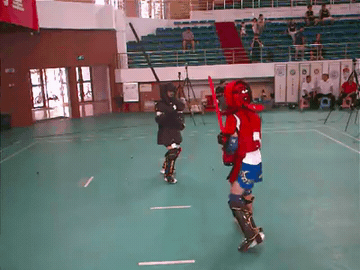
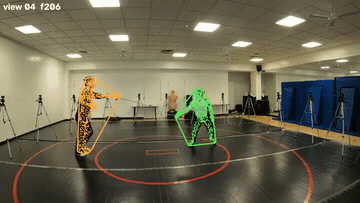
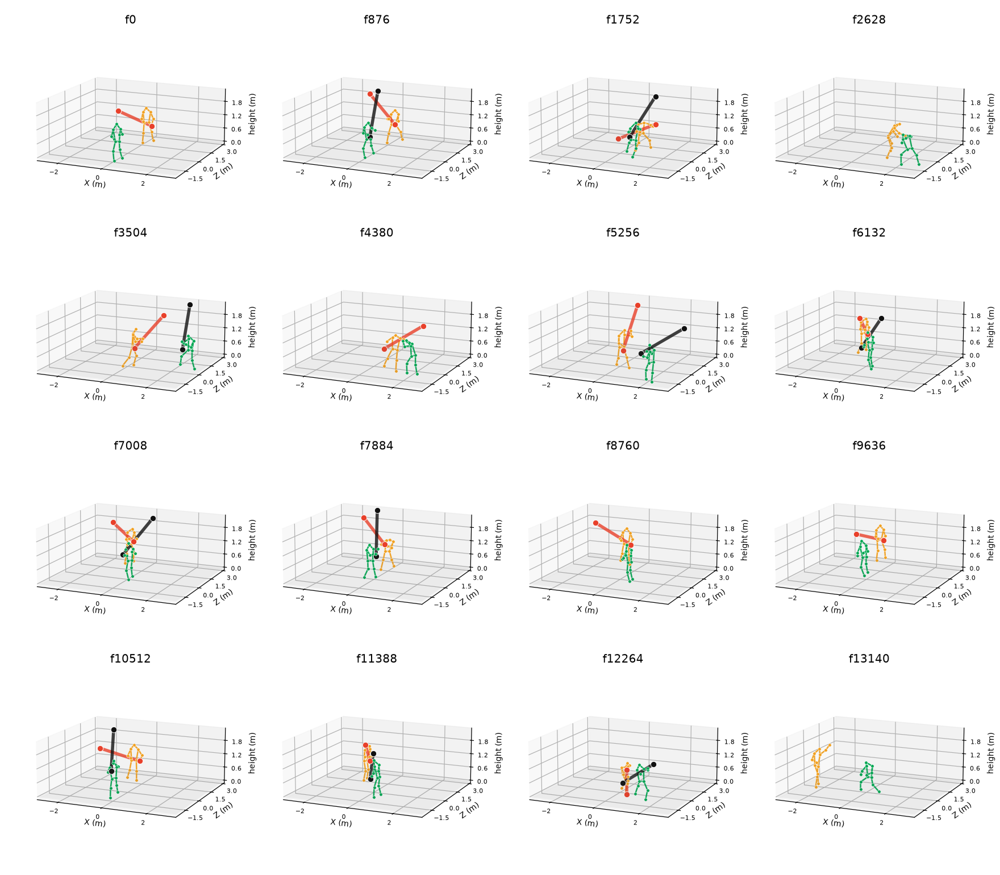
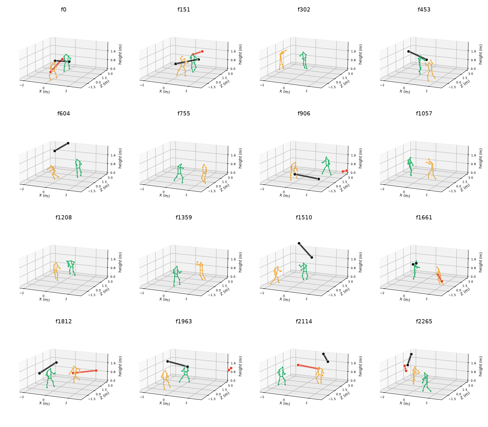

# Combat3D

**Monocular 3D human pose in high-occlusion contact sports — without motion capture.**

Combat3D is a *zero-manual-annotation* 3D label-production framework plus the monocular
lifting recipe built on top of it, evaluated on **Harmony4D** (close-contact combat:
wrestling / jiu-jitsu / MMA / sword) and cross-validated on **CMU Panoptic** (independent
optical mocap).

The domain of interest — two athletes in continuous body contact — is one where **motion
capture physically cannot produce ground truth**: reflective markers are occluded by the
opponent and by the subject's own body, and body contact knocks them off. There is no
cost argument here; it is a physical constraint. This repository is the artifact behind
the claim that a *zero-annotation* multi-view pipeline can produce labels good enough to
fine-tune an off-the-shelf monocular lifter into that domain, and it quantifies exactly
what that costs.

> **This is a measurement-oriented contribution, not a new network.** The pipeline is
> assembled from existing components (multi-view triangulation, SMPL fitting, an
> off-the-shelf monocular lifter). We do **not** claim architectural novelty. What we
> provide is a *layer-wise error budget* for the zero-annotation route, seven
> ablation-backed rules, and the code + weights + exact commands to reproduce every
> number we report.

---

## Demo

Short segments from the **armored stick-fighting** domain — our own dataset, and the
second domain in which the layer contract was validated.

<p align="center">
  
  
</p>

**Left — raw footage** from a single camera view.
**Right — SMPL fitted to the triangulated labels**, overlaid on the source view.

Still frames reconstructed in world space (pose nodes only; the weapon is deliberately not
drawn, as it is outside what this pipeline reconstructs):

<p align="center">
  
  
</p>

Full-length clips: [`media/demo_raw.mp4`](media/demo_raw.mp4) · [`media/demo_smpl.mp4`](media/demo_smpl.mp4)

> **Note on the footage.** These are real people from a private dataset. See the terms in
> `Combat3D-kendo-0.1-sample/README.md` §5 — research reproduction only; do not
> redistribute; do not attempt to identify the individuals.

---

## Results at a glance

All numbers are **MPJPE / PA-MPJPE in mm**, root-relative, evaluated on **9 genuinely
held-out Harmony4D takes against the official Harmony4D GT** (six `sword3` takes that
overlap the training source sequences are removed as leakage).

| Arm | Upstream (box / identity / 2D) | 3D labels | Train takes | MPJPE / PA |
|---|---|---|---|---|
| **A** | official | official GT | 69 | 58.1 / 26.6 |
| **B-69** | official | ours (triangulated) | 69 | 65.6 / 38.2 |
| **B** | official | ours (triangulated) | **150** | **42.4 / 32.6** |
| **C** | fully self-built | ours (triangulated) | 123 | 116.9 / 91.6 *(exploratory, see note)* |
| Official MotionBERT, zero-shot | — | — | — | 94.3 / 66.8 |

Decomposition this yields:

1. **Label layer cost = +7.5 mm (+13%)** — A → B-69, same 69 takes, same 828 npz.
2. **More data beats cleaner labels** — the full 150-take arm (42.4) overtakes the
   official-GT arm trained on 69 takes (58.1) by 27%.
3. **Self-built upstream cost = +74.5 mm (2.8×)** — but see the caveat below; this is
   not a fair comparison and arm C is **not** a primary result.

**Caveat that decides the framing of arm C.** The official Harmony4D `poses2d` are
*SMPL-fit projections*, not detections: their per-joint confidence is identically
`1.000` with 17/17 usable joints, whereas our ViTPose output has confidence 0.58–0.89
and 15.5/17 usable joints. Any "self-built 2D vs official 2D" comparison is therefore
unfair by construction — the official 2D "already knows what the answer should look
like". Arm C is retained as an **exploratory upper bound on the cost**, not as a
like-for-like baseline.

### Absolute positioning (a layer the literature discards by definition)

Shape metrics are root-relative and therefore *cannot* see absolute placement. We treat
absolute positioning as an orthogonal layer and attach a root-regression head:

| Absolute root-position error (median) | |
|---|---|
| Geometric prior (depth from a fixed bone-length assumption) | 996 mm |
| **Combat3D root-regression head** | **9 mm** |

The head bolts onto *any* root-relative lifter and is what turns a floating skeleton
into a usable world-space trajectory (inter-athlete distance, tactical analysis,
re-projection).

### Cross-domain transfer to independent optical mocap

CMU Panoptic, PA-MPJPE, same architecture, zero-shot vs fine-tuned:

| | Harmony4D (in-domain) | CMU Panoptic (cross-domain) |
|---|---|---|
| Official MotionBERT, zero-shot | PA 66.8 | PA 101.2 |
| **Combat3D (fine-tuned)** | **PA 32.6** | **PA 74.0 (−27%)** |

### Same-protocol baseline comparison

Every baseline is fine-tuned **from its public pre-trained weights**, on the same H4D
training set with the same 2D input and the same `(take, view)` alignment procedure.

| Method | Zero-shot (15 test takes) | Fine-tuned from public weights (val) | **Fine-tuned, 9 held-out** (same protocol as the main table) |
|---|---|---|---|
| VideoPose3D (detectron weights) | 276.6 / 174.2 | **106.1** | **188.3 / 138.7** |
| VideoPose3D (cpn weights) | — | 115.9 | **186.9 / 137.4** |
| MixSTE | 154.8 / 112.2 | *(ONNX only, no PyTorch weights — omitted)* | — |
| **Combat3D-Mono (ours)** | **15.8 / 10.4** | **18.4** | **42.4 / 32.6** |

**Comparable reading (identical held-out protocol): VideoPose3D 188.3 vs ours 42.4 — 4.4×.**
(The val-only reading is 106.1 vs 18.4 = 5.8×; val is the model-selection set, so quote the
held-out column.) Every "ours" number in this repository uses the **same** checkpoint,
`Combat3D_FULL.pt`.

> A from-scratch training variant was run and then **discarded**: it measures data
> efficiency, not architecture, and comparing a heavily pre-trained model against a
> from-scratch baseline is not a fair protocol.

---

## Seven ablation-backed findings

Each is verifiable from the artifacts in this repository, and (to our knowledge) each was
previously unreported.

| # | Finding | Measured | Why it is counter-intuitive |
|---|---|---|---|
| **F1** | Zero-annotation cost **at the label layer** is small | **+7.5 mm (+13%)**, controlled: 69 takes / 828 npz on both sides | The default assumption is that without annotation you cannot learn |
| **F2** | The marginal value of **data volume** exceeds that of **label precision** | 150-take arm at **42.4** beats the official-label arm at 69 takes by **27%** | It not only recovers the 13% gap, it overtakes it |
| **F3** | **Frame-level quality filtering is a net loss** at this data scale | All three arms get worse: A 56.7→72.2, B **18.4→56.4**, C 151.7→255.5 | "Clean your data" is treated as universally good |
| **F4** | The triangulation layer's robustification **only helps when upstream is dirty** | clean upstream: **identical** to the naive baseline (< 1e-6); dirty upstream: median **36.7→20.5 (−44%)** | It is not "always better" — it is a *noise-suppression device* |
| **F5** | A wrong per-`(take, view)` **scale convention** inflates end-to-end error **6×**, silently | **190.3 → 27.5 mm** after the fix; "residual rotation" 30° → 3.7° | It raises no exception and produces plausible-looking output |
| **F6** | Cross-domain gain **transfers to independent optical mocap** | same architecture: PA **101.2 → 74.0 (−27%)** | Rules out the gain being self-justification against our own labels |
| **F7** | The root-regression head turns absolute placement from **110×** worse into usable | **996 → 9 mm** | Almost every monocular paper discards this layer by definition of its metric |

**F1–F3 answer "what does it cost"; F4–F5 answer "where does the error live"; F6–F7
answer "is it real and is it useful".**

### Design principle that follows

Splitting label production into five layers, our measurements support one operational rule:

> **The detection-box layer and the identity layer are *scene-specific* — adapt them per
> scene (and if the scene already gives you boxes and identities, use those instead).
> The triangulation layer and everything below it are *universal*.**

Supporting evidence: a **single** change at the identity layer — rejecting candidate
boxes whose centre falls outside the frame border — moves person-selection accuracy from
**72.0% to 95.7%**, and end-to-end error from **383.2 mm to 39.1 mm** (a 10× gap). That
is direct evidence these layers are determined by scene conditions, and that designing
them as pluggable is the right call. On our own armored stick-fighting data the same layer needed
jersey-colour cues plus a global consistency curve — further evidence that the layer is
scene-specific by nature.

---

## Repository layout

```
Combat3D/
├── code/                     # label-production pipeline (adapters + stages + eval + viz)
│   ├── adapters/harmony4d/   # Harmony4D adapter: calib / frames / boxes / gt
│   │   └── pipeline/         #   detect → 2D → assemble → triangulate → fit
│   ├── adapters/panoptic/    # CMU Panoptic adapter (cross-domain transfer)
│   ├── eval/                 # metrics, audits, stratification
│   ├── stage1_detect … stage8_render/
│   ├── viz/                  # re-projection overlays, 3D renders
│   └── env/sitecustomize.py  # py3.12 / numpy2 compatibility shim (required)
├── monocular/                # the monocular lifter layer (MotionBERT fine-tuning)
│   ├── kb/                   #   kb_train.py, kb_common.py, data builders, QA
│   ├── mb_npz.py             #   Harmony4D artifacts → training npz
│   ├── mb_to_final13.py      #   fine-tuned lifter → final 13-joint world output
│   ├── roothead*.py          #   absolute root-position regression head
│   └── h4d_metrics.py        #   unified evaluation metric (fisheye convention)
├── scripts/
│   ├── README.md             # ★ call order table
│   ├── 00_env.sh … 16_figs.sh  # stage wrappers, numbered in execution order
│   └── tools/                # verbatim driver scripts as run on the server
├── configs/h4d_metric_scale.json
├── weights/README.md         # where to put the downloaded checkpoints
├── data/DATASETS.md          # every npz dataset produced, with counts
├── figs/                     # fig1…fig9, as used in the paper
├── docs/
│   ├── REPRODUCE.md          # ★ full reproduction guide, in call order
│   ├── PITFALLS.md           # 15 pitfalls ranked by cost
│   ├── METRICS.md            # ★ which numbers are valid and which are retracted
│   ├── ENV_pose312.md        # exact environment recipe + 8 install traps
│   ├── SECOND_DOMAIN.md      # ★ the armored stick-fighting second-domain evidence
│   ├── H4D_adapter_README.md
│   ├── paper/                # manuscript source (EN + 中文)
│   └── notes/                # original session records (Chinese)
└── (the manuscript and the working session history are not part of this release)
```

## Quick start

```bash
git clone https://github.com/I-min-Lee/Combat3D.git && cd Combat3D

# 1. weights (1.2 GB) are NOT in the repo — download from GitHub Releases, then:
bash scripts/00_env.sh                     # checks env + places ckpt/ where code expects
python scripts/tools/z25_gtEval.py ckpt/Combat3D_FULL.pt    # reproduce the main number

# 2. full pipeline from Harmony4D raw data:
#    see docs/REPRODUCE.md — scripts/01…25 run in numbered order

# 3. second domain (armored stick-fighting): grab Combat3D-armored stick-fighting-1.1-sample.zip from Releases
#    — 1000 frames of real footage with 3D labels, 2D, calibration, weights and
#      the scene-specific detection + identity scripts. See docs/SECOND_DOMAIN.md
```

Environment: Python 3.12, **torch 2.4.1+cu121**, mmcv 2.2.0 (official prebuilt) — see
[`docs/ENV_pose312.md`](docs/ENV_pose312.md). Two hard rules:

* **Do not install or upgrade packages.** A single `pip install local-attention` pulled
  in `nvidia-cudnn-cu13` and silently broke every convolution layer. Recovery:
  `pip install --force-reinstall --no-deps nvidia-cudnn-cu12==9.1.0.70`
* **Do not modify triangulation for inference.** Triangulation is a *training-label /
  offline-ground-truth* device only. See [`docs/METRICS.md`](docs/METRICS.md).

## Checkpoints

See [`weights/README.md`](weights/README.md) for the full table and MD5s. Primary:

| File | Role |
|---|---|
| `Combat3D_FULL.pt` | **arm B — the main result** |
| `Combat3D_GTlabel2.pt` | arm A (official GT labels) |
| `Combat3D_OurLabel69.pt` | arm B-69 (controlled comparison) |
| `Combat3D_SelfLabel_v2.pt` | arm C (exploratory) |
| `rh_h4d_v04_w0_full.pt` | root-regression head (9 mm) |
| `base_vp3d_ft120.pt`, `base_mixste_ft.pt` | fine-tuned baselines |

## What this work does *not* claim

* **No new architecture.** The pipeline is assembled from existing components.
* **"Training without mocap" is not a novel idea.** Multi-view pseudo-labels for
  monocular lifting is an established route (≥ 2020, e.g. Iqbal & Kautz CVPR 2020,
  MetaPose CVPR 2022, and arXiv:2504.12699 which we cite and compare against).
* **Not a CCF-A system paper.** This is a measurement + protocol contribution.
* **Weights are derivatives.** Fine-tuned from MotionBERT / VideoPose3D / MixSTE
  checkpoints; the upstream licences still apply.

## Citation

See [`CITATION.cff`](CITATION.cff).

## License

MIT — see [`LICENSE`](LICENSE). Upstream model weights retain their own licences.

---

# 中文说明

**Combat3D** 面向**高遮挡、强对抗的贴身格斗场景**（摔跤 / 柔术 / MMA / 盔甲对抗棍棒格斗）的单目 3D
人体姿态估计。这类场景是**动捕物理上无法覆盖**的——贴身时反光 marker 被对手和自身身体
遮挡，身体接触还会把 marker 碰掉。这不是成本问题，是物理约束。

本仓库是论文的**全部可复现产物**：代码、权重、配置、以及能逐条重跑出论文每个数字的命令。

**这不是"新网络"型贡献，是"测量 + 协议"型贡献。** 管线由现成组件组装，我们不主张架构新颖性。
我们提供的是：零人工标注这条路线的一份**逐层误差预算**、七条**有消融支撑的结论**、
以及一条**经过测量支持的设计原则**（检测框层/身份层场景相关、三角化层及以下通用）。

**主结果**（9 条真 held-out，对官方 Harmony4D GT，MPJPE / PA，mm）：

| 臂 | 上游 | 3D 标签 | 训练量 | MPJPE / PA |
|---|---|---|---|---|
| A | 官方 | 官方 GT | 69 take | 58.1 / 26.6 |
| B-69 | 官方 | 自建三角化 | 69 take | 65.6 / 38.2 |
| **B** | 官方 | 自建三角化 | **150 take** | **42.4 / 32.6** |
| C | 全自建 | 自建三角化 | 123 take | 116.9 / 91.6（**探索性，非主结果**）|
| 官方 MotionBERT 零样本 | — | — | — | 94.3 / 66.8 |

**七条结论**：① 零标注在标签层的代价仅 +13%（受控对照）；② 数据量的边际收益 > 标签精度
（150 take 反超 27%）；③ 帧级质量筛选在小数据规模下是净损失（三臂全部变差）；④ 三角化层的
鲁棒化只在上游脏时起作用（干净上游与朴素做法完全相同）；⑤ 逐 (take,view) 尺度约定写错会让
端到端虚高 6 倍且完全静默；⑥ 跨域增益可迁移到独立真动捕（同架构 −24%）；⑦ 根回归头把绝对
定位从 996 mm 压到 9 mm（110×）。

**先从 [`docs/REPRODUCE.md`](docs/REPRODUCE.md) 读起**——它是按调用顺序写的完整复现指南。
写论文或引用数字前**必读 [`docs/METRICS.md`](docs/METRICS.md)**（里面列了已作废的数字口径）。
